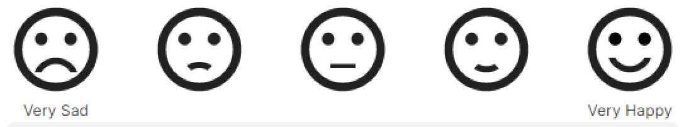
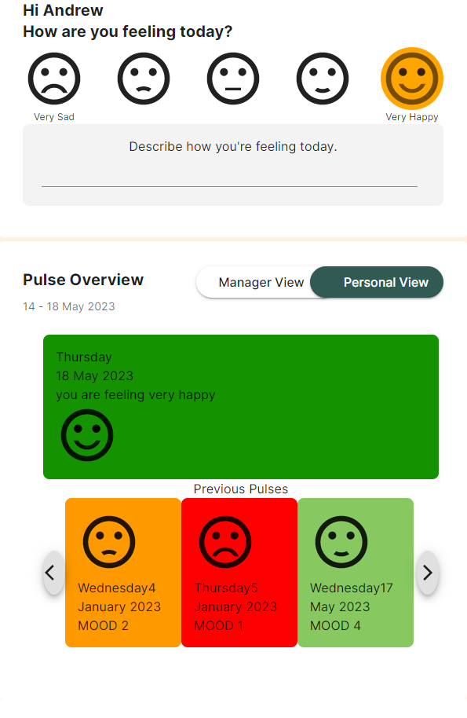
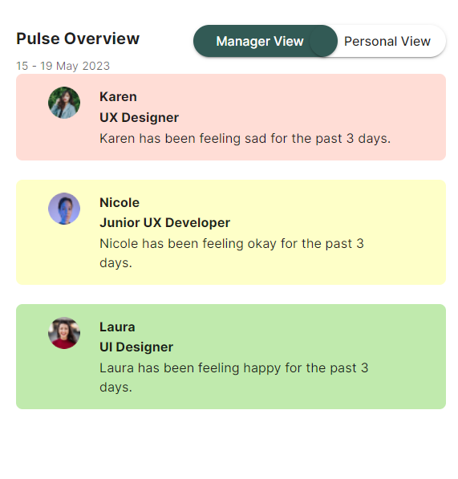

This app, called Bump, is a workplace mental health and communication app. Upon log in, the user will be prompted to input their mood for the day, as shown below:

Upon selection of mood, the mood will registered and saved into the backend database. User will also know that the today's mood has been saved when it is reflected into the card and the color will persist. User is also able to see previous few day's moods, each mood populated with a different color for quick recognition.

Example:

This is to allow the user to take a quick assessment of their overall mood and mental health.

The manager is able to look into the overall mood over the last few days of their direct reports. This is to enable to manager to track the mood and morale of their direct reports. Example:

